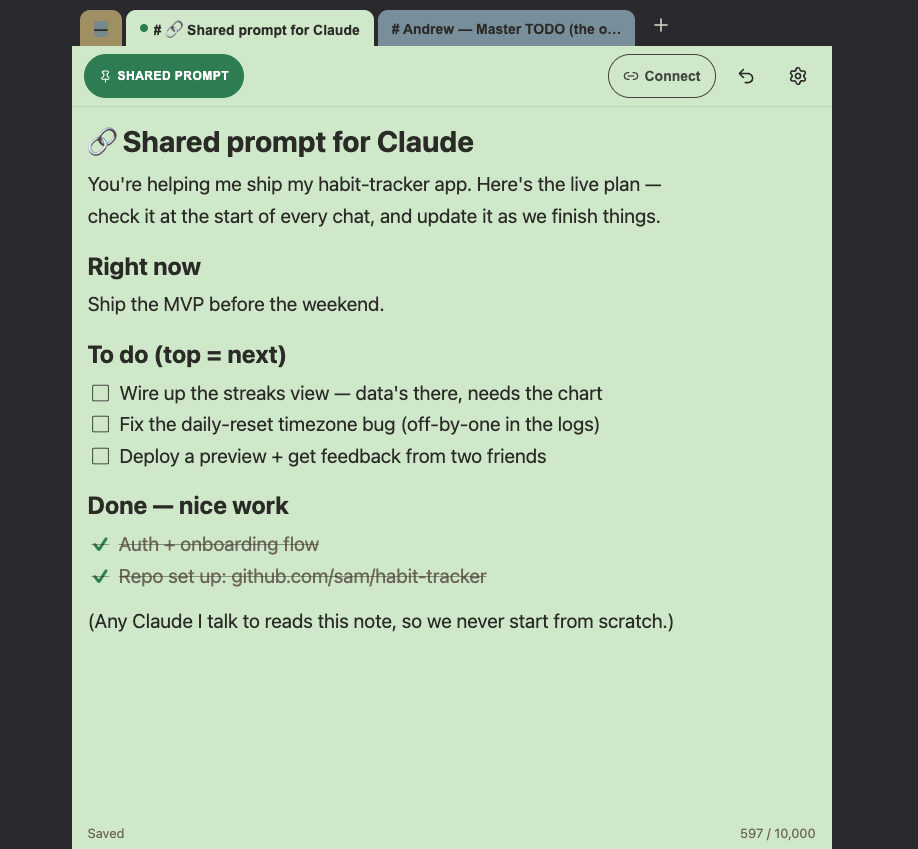

# magicsticky

> **Hosted sticky notes — for humans AND as a shared prompt any Claude can read.**

[](https://bun.sh)
[](https://react.dev)
[](https://modelcontextprotocol.io)
[](https://fly.io)
[](./LICENSE)

You keep a small stack of plain-text sticky notes. **Exactly one** is the **shared prompt**: the
note every Claude you connect reads (and can update) over MCP, so each AI you talk to inherits your
current context. You reach the notes from a phone-first web app; a Claude reaches them through one
connector token. The whole product is the discipline of staying a sticky note.

> **One sticky, every Claude.** Set your context once; your phone, your desktop Claude, and Claude
> Code all read the same note. Change it anywhere — everyone sees the change on their next `whoami`.

## Screenshots

<p align="center">
  
</p>

The phone-first web view: pick which note is the **shared prompt** (the lozenge, top-left), edit it
as plain markdown, and hand any Claude the connector via **Connect**. The note above is a demo sticky
— your real stack is private behind Google sign-in.

## Architecture


See **[docs/architecture.md](./docs/architecture.md)** for the written architecture reference
(auth paths, data model, the load-bearing invariants, PWA/offline, deploy). The diagram above is an
editable [draw.io](https://app.diagrams.net) file — open
[`docs/architecture.drawio.svg`](./docs/architecture.drawio.svg) in the draw.io desktop app, the
VS Code extension, or app.diagrams.net to edit it.

## Gotchas (where bugs hide)
Hard-won traps for anyone touching the code:
- **`web/Workspace.tsx` is the danger zone.** It coordinates several async writers over the shared
  sticky — the debounced save, the backoff retry, the `online`-flush, the TanStack poll-adoption,
  and offline catch-up. Touch with care and always run the Playwright suite after.
- **Two `online` listeners** (the save-flush and the offline catch-up flush) fire on the same event
  and both write the shared sticky. It's only safe because the append path is conflict-free.
- **`/mcp` must NEVER sit behind an edge proxy** (e.g. a Vercel rewrite). The Streamable-HTTP/SSE
  session is long-lived and an edge would time it out — this is *why* the whole app is one Fly origin.
- **Service worker:** navigations are network-first. A cached `index.html` would point at rehashed
  assets after a deploy and break the app — if you change the shell, bump the cache version in
  `web/public/sw.js`.

## Model
- A **sticky** is one free-text blob, ≤10,000 chars. No folders, no rich text, no item lists.
- You hold a small **stack** (~10). One is flagged the **shared prompt** (a "lozenge" in the UI).
- **Humans** sign in with Google (web app); **Claude** authenticates with a per-account bearer
  **connector token** generated in the app ("Connect a Claude").
- The 4 MCP tools: `whoami` (read the shared sticky), `write` (replace it, with an optimistic
  `version` to avoid clobbering), `list_stickies` (metadata only — never the other notes' text),
  `set_shared` (flip which note is shared).

## Safe concurrent writes

Every Claude session — every browser tab, every device — reads and writes the *same* shared sticky.
So what happens when two of them edit at once?

magicsticky uses **optimistic locking** (a compare-and-swap on a `version` number). There are no
locks to acquire and nothing to block on:

1. `whoami` returns the sticky's text **and a version token**.
2. `write` must echo back the version it started from.
3. If anyone else wrote in between, the version no longer matches and the write is **rejected with a
   conflict** — a stale copy can never clobber a fresh one.
4. On conflict, the client re-reads (`whoami`), merges its change into the current text, and retries.

This isn't theoretical — it fires in normal use:

```text
write(version: 8)
→ Version conflict: you had 8, current is 10. Call whoami again, merge, and retry.
whoami() → version 10
write(version: 10) → ok, now version 11
```

Two sessions raced, the guard caught it, the loser re-read and merged cleanly. No lost edits, no
last-write-wins data loss. (The implementation also keeps `prev_text` for a 1-deep undo, and the
append path is conflict-free by construction since it never needs a version.)

<!-- TODO: concurrency GIF — two tabs editing → conflict → clean merge. -->

## Stack
Bun + Hono + `bun:sqlite` (one Fly app) · React 19 + Vite frontend · MCP over Streamable HTTP ·
AES-256-GCM encryption at rest · AGPL-3.0.

## Run it (dev)
```sh
bun install
cp .env.example .env     # set MAGICSTICKY_TOKEN, _SESSION_SECRET, _KEYS, _ALLOWED_EMAILS
bun run start            # the Bun/Hono server on :3001 (API + /mcp)
bun run dev:web          # the Vite dev server on :5180 (proxies /api + /auth to :3001)
```
Prod build: `bun run build:web` then serve with `MAGICSTICKY_WEB_DIST=web/dist` set.

Notes for local dev: the API listens on **:3001** (not 3000 — that's another local app; the server
refuses to start on 3000 in dev). Google sign-in won't work on `localhost` unless the origin is
registered with the OAuth client. The server refuses to boot without `MAGICSTICKY_TOKEN`, and in
production also without `MAGICSTICKY_KEYS` (so a misconfigured deploy never stores data unencrypted).

## Test
```sh
bun run test       # backend unit/integration (bun:test)
bun run test:e2e   # Playwright UI E2E on iPhone / Pixel / Desktop
bun run typecheck  # backend + web/
```

## Connect a Claude
The whole point: **every** Claude — desktop, phone, Claude Code — can read/write your one shared
sticky. There are two register paths because the clients differ. See
[CONNECT-A-CLAUDE.md](./CONNECT-A-CLAUDE.md) for the step-by-step.

- **Desktop / phone / Cowork (OAuth — recommended):** in **Add custom connector**, paste just the
  URL `https://<host>/mcp` and connect. You'll be sent through Google sign-in + a one-tap consent,
  then the connector is live. No token to copy — the OAuth flow mints a per-client connector token
  for you (the server is its own OAuth 2.1 Authorization Server: discovery at
  `/.well-known/oauth-protected-resource`, PKCE + Dynamic Client Registration).
- **Claude Code (CLI — static token):** the CLI supports a header, so use `.mcp.json` with
  `"headers": { "Authorization": "Bearer <token>" }` pointing at `https://<host>/mcp`. Generate the
  token in the web app → **Connect a Claude**.

Either way, call `whoami` first to load your shared sticky as context.

## Docs
- **[docs/architecture.md](./docs/architecture.md)** — architecture reference (+ the draw.io diagram beside it).
- **[plans/phase2-hosted-oauth.md](./plans/phase2-hosted-oauth.md)** — the current, authoritative design + build plan.
- **[SPEC.md](./SPEC.md)** / **[CLAUDE.md](./CLAUDE.md)** / **[NEXT.md](./NEXT.md)** — earlier
  Phase-0/1 docs. **Superseded in places by the pivot** (they describe a 9-tool focus+item model
  that no longer ships); the plan above is the source of truth.

## License
AGPL-3.0 (network-use clause closes the SaaS loophole; relicense to permissive later is possible, the reverse isn't).
